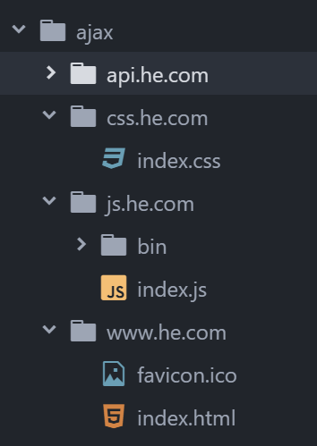

####<center>hosts文件管理和nginx总结</center>
##### hosts文件管理
1.找到hosts文件
&emsp;&emsp;把域名指向想要指向的机器
2.hosts文件存放的目录
&emsp;&emsp;C:\Windows\System32\drivers\etc\hosts
3.修改本机hosts文件地址
&emsp;&emsp;打开hosts文件看见前面带#号的是注释的意思
127.0.0.1 指的是本机地址，修改格式：

- - -
#####nginx如何配置
1.构建文件格式

2.html里的css样式连接方法

3.html里面的就是连接写法

4.nginx可以做web服务(http服务)
5.需下载nginx官网http://nginx.org/ 下载一般是下载Stable version,nginx绿色版的免安装直接就可以用
6.启动nginx我们一般是在黑窗口启动用命令启动
&emsp;&emsp;1.启动nginx命令： start nginx
&emsp;&emsp;2.重启nginx命令： nginx -s reload
&emsp;&emsp;3.停止nginx命令： nginx -s stop
7.找配置文件
&emsp;&emsp;找到conf配置文件里的nginx.conf我们就可以将其进行配置。配置的时候需慎重不要配错了，打开nginx.conf一会看见一堆代码。同样你看见带#号也是注释的意思下面我们配置文件,
```html
这代码要写在http里面
下面这段是配置首页html
server {
        listen       80;
        server_name  www.he.com;<!--hosts文件配置的地址-->

        location / {
            root   F:\ajax\www.he.com;<!--这是请求文件的地址-->
            index  index.html ;<!--index指的是首页的HTML-->
        }
    }
这段是配置css样式
server {
        listen       80;
        server_name  css.he.com;

        location / {
            root   F:\ajax\css.he.com;
        }
    }
同样如下你的js文件也需要配置
server {
        listen       80;
        server_name  js.he.com;

        location / {
            root   F:\ajax\js.he.com;
        }
    }

配置完成之后需要重新启动下nginx命令：nginx -s reload，每次修改nginx.conf文件都需要重启
```
配置完成之后我没就可以在浏览器上输入我们的域名就可以看见页面了

